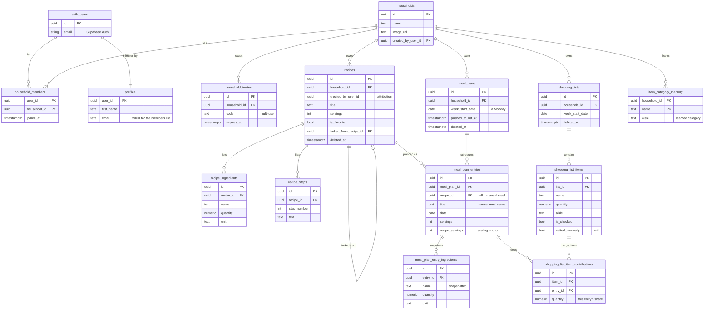

# Prep+Eat – data model

How the database fits together. Generated from the migrations in
[`supabase/migrations/`](../supabase/migrations/) – if you change the schema
there, update this doc in the same pass.

The whole model turns on one idea: a **household** owns everything, and each
person always belongs to at least one. Recipes, the weekly plan, and the
shopping list all hang off that.

- **16 tables**, Postgres on Supabase
- **Row-level security** scopes every table to household members
  (`is_household_member()`)
- **Realtime** only where it matters: the meal plan and the shopping list

## Entity relationship diagram

Read a line as "one → many": the round end is the *one*, the branched
(crow's-foot) end is the *many*. So one household has many recipes; one recipe
has many ingredients.

**Legend.** `PK` = primary key, `FK` = foreign key (points at another table).
`deleted_at` marks a soft delete (row hidden, never destroyed). Every table
also carries `updated_at` for last-write-wins sync (omitted above for
readability).

## The four groups, in plain language

Tables marked **realtime** sync live across every phone in the household.

### People & household – who's in the family, and how they got there

| Table | What it's for |
| --- | --- |
| `households` | The family unit. Owns everything below. Has a name and optional image. |
| `household_members` | Links a person to a household. Everyone belongs to at least one. |
| `household_invites` | One fridge-worthy code the whole family can reuse to join. |
| `profiles` | A safe copy of each person's name + email so the members list can show them. |

### Recipes – the household cookbook

| Table | What it's for |
| --- | --- |
| `recipes` | Title, servings, photo, favorite heart. Soft-deletable; carries who created it. |
| `recipe_ingredients` | Each ingredient as amount + unit ("250 g flour"). |
| `recipe_steps` | The numbered method. |

### Weekly meal plan – what we're eating, day by day

| Table | What it's for |
| --- | --- |
| `meal_plans` *(realtime)* | One plan per household per week (weeks start Monday). |
| `meal_plan_entries` *(realtime)* | A meal on a day – either a recipe or a typed manual meal ("Leftovers"). |
| `meal_plan_entry_ingredients` | A frozen copy of the recipe's ingredients at the moment it was added. |

### Shopping list – the auto-built list, plus what taught it

| Table | What it's for |
| --- | --- |
| `shopping_lists` *(realtime)* | One list per household per week, mirroring the plan's weeks. |
| `shopping_list_items` *(realtime)* | A line to buy: name, quantity, aisle, ticked-or-not. |
| `shopping_list_item_contributions` | Which meals fed a merged line, so one meal's change rescales only its share. |
| `item_category_memory` | Each household teaches its own app which aisle an item belongs in. |

## Three rules that shape everything

These decisions (from
[`docs/projektgrundlag.md`](projektgrundlag.md)) are why the tables look the
way they do.

- **Snapshot, don't link.** When a recipe joins the plan, its ingredients are
  frozen onto the entry (`meal_plan_entry_ingredients`). Editing the recipe
  later never silently changes an already-planned week or its shopping list.
- **Soft delete.** Deleting sets `deleted_at` instead of removing the row.
  Safer for sync, and a departing member keeps a working snapshot of shared
  recipes (copy-on-leave).
- **Last write wins.** Every table stamps `updated_at`. When two phones edit at
  once, the most recent write is kept – no lock screens, no merge prompts.
